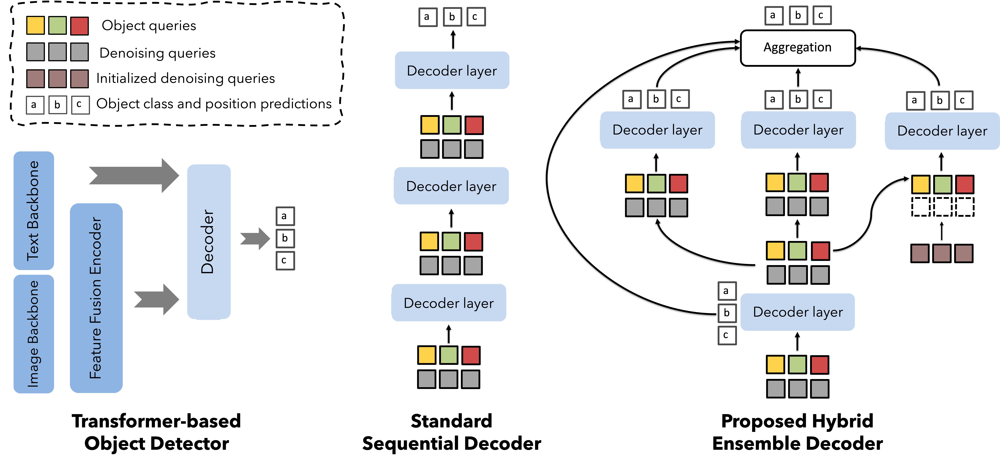

<h1 align="center">A Closer Look at Cross-Domain Few-Shot Object Detection:<br>Fine-Tuning Matters and Parallel Decoder Helps</h1>

<p align="center">
  <a href="https://intellindust-ai-lab.github.io/projects/FT-FSOD/"></a>
  <a href="https://arxiv.org/abs/2603.28182"></a>
  <a href="./LICENSE"></a>
</p>

<p align="center">
  <a href="https://xuanlong-yu.github.io/">Xuanlong Yu</a><sup>1</sup>,
  Youyang Sha<sup>1</sup>,
  <a href="https://capsule2077.github.io/">Longfei Liu</a><sup>1</sup>,
  <a href="https://xishen0220.github.io/">Xi Shen</a><sup>† 1</sup>,
  <a href="https://walker1126.github.io/">Di Yang</a><sup>† 2</sup>
</p>

<p align="center">
  <sup>1</sup><a href="https://intellindust-ai-lab.github.io/">Intellindust AI Lab</a> &nbsp;&nbsp; <sup>2</sup>Suzhou Institute for Advanced Research, USTC
</p>

---

## 🔍 TL;DR

- We introduce a Hybrid Ensemble Decoder (HED) to improve query diversity and model robustness.
- We propose a simple fine-tuning recipe for cross-domain few-shot object detection, with plateau-aware scheduling and progressive optimization.
- This repository includes:
  - Training/evaluation code and configs for CD-FSOD, ODinW-13, and RF100-VL benchmarks.
  - A challenge subproject: [NTIRE 2026 CDFSOD Challenge](./NTIRE%202026%20CDFSOD%20Challenge%20/README.md), including pseudo-label annotation strategy and challenge-oriented pipeline details.

<p align="center">

</p>

---


## 📦 Installation
```bash
# Create conda environment
conda create -n ft-fsod python=3.10 -y
conda activate ft-fsod

# Install PyTorch first (pick the command matching your CUDA)
# Example for CUDA 12.1
pip install torch torchvision --index-url https://download.pytorch.org/whl/cu121

# Install OpenMMLab dependencies
pip install -U openmim
mim install "mmengine"
mim install "mmcv==2.1.0"
mim install mmdet

# Common dependencies
pip install -r requirements.txt
```

<small><b>Deterministic hack (MMEngine):</b> to reduce few-shot training instability, we set `deterministic=True` in configs, which needs to patch MMEngine as follows:<br></small>
<small>1) `mmengine/runner/runner.py` (`set_randomness`): add `warn_only: bool = True` and pass `warn_only=warn_only` to `set_random_seed`.<br></small>
<small>2) `mmengine/runner/utils.py` (`set_random_seed`): add `warn_only: bool = True`, and change to `torch.use_deterministic_algorithms(True, warn_only=warn_only)`.<br></small>
<small>Refs: <a href="https://github.com/open-mmlab/mmengine/blob/main/mmengine/runner/runner.py#L698">runner.py#L698</a>, <a href="https://github.com/open-mmlab/mmengine/blob/main/mmengine/runner/runner.py#L719">runner.py#L719</a>, <a href="https://github.com/open-mmlab/mmengine/blob/main/mmengine/runner/utils.py#L48">utils.py#L48</a>, <a href="https://github.com/open-mmlab/mmengine/blob/main/mmengine/runner/utils.py#L90">utils.py#L90</a>.</small>

---


## 📍 Fine-tuning on Benchmarks
#### 1) Download bert-base-uncased, pre-trained weights and train models

- Download bert-base-uncased and nltk_data following this [instruction](bert-base-uncased)

- Download pre-trained weight from: [MMGDINO-B](https://download.openmmlab.com/mmdetection/v3.0/mm_grounding_dino/grounding_dino_swin-b_pretrain_all/grounding_dino_swin-b_pretrain_all-f9818a7c.pth) and [MMGDINO-L](https://download.openmmlab.com/mmdetection/v3.0/mm_grounding_dino/grounding_dino_swin-l_pretrain_all/grounding_dino_swin-l_pretrain_all-56d69e78.pth)

- Adjust the dataset path and pre-trained weight path in `src_path.py`

#### 2) Run the following scripts to fine-tune the models on various benchmarks
- **CD-FSOD (1/5/10-shot train+eval):** `bash run_mmgdinob_traineval_cdfsod.sh`
- **ODinW-13 (1/3/5/10-shot, multi-seed):** `bash run_mmgdinol_traineval_odwin.sh`
- **RF100-VL (10-shot):** `bash run_mmgdinol_traineval_rf100vl.sh`
- **CD-Mixed OOD evaluation (1/5/10-shot):** `bash run_mmgdinob_eval_cdmixed.sh`

<small><i>Due to the instability of few-shot fine-tuning (even if the random seed is fixed), the results will be slightly different from the ones in the paper. </i></small>


## 🏁 NTIRE 2026 CDFSOD Challenge

Challenge materials and instructions are in the same repository: [NTIRE 2026 CDFSOD Challenge](./NTIRE%202026%20CDFSOD%20Challenge%20/README.md).  
It includes our challenge-oriented pipeline, such as pseudo-label annotation strategy using FSOD-mAP as the evaluation metric for annotation selection, model fine-tuning and TTAs.

---


## 📊 Result Aggregation

CD-FSOD:

```bash
python analyze_results_cdfsod.py <experiment_directory_path>
# e.g.
python analyze_results_cdfsod.py exp_cdfosd_results
```

ODinW-13:

```bash
python analyze_results_odinw.py <experiment_directory_path>
# e.g.
python analyze_results_odinw.py exp_odinwfsod_results
```

RF100-VL:

```bash
python analyze_results_rf100.py <experiment_directory_path>
# e.g.
python analyze_results_rf100.py exp_rf100vlfsod_results
```

---

## 🙏 Acknowledgements

This project is built on top of the [OpenMMLab ecosystem](https://github.com/open-mmlab/mmdetection), [RF100-VL benchmark](https://github.com/roboflow/rf100-vl), [CD-FSOD benchmark](https://github.com/lovelyqian/CDFSOD-benchmark) and [OdinW-13 benchmark](https://github.com/microsoft/GLIP).

---

## 📚 Citation

If you find this project useful in your research, please consider citing:

```bibtex
@inproceedings{yu2026acloser,
  title={A Closer Look at Cross-Domain Few-Shot Object Detection: Fine-Tuning Matters and Parallel Decoder Helps},
  author={Yu, Xuanlong and Sha, Youyang and Liu, Longfei and Shen, Xi and Yang, Di},
  booktitle={Proceedings of the IEEE/CVF Conference on Computer Vision and Pattern Recognition (CVPR)},
  year={2026}
}
```

---

## 📄 License

This project is released under the [Apache 2.0 License](./LICENSE).
